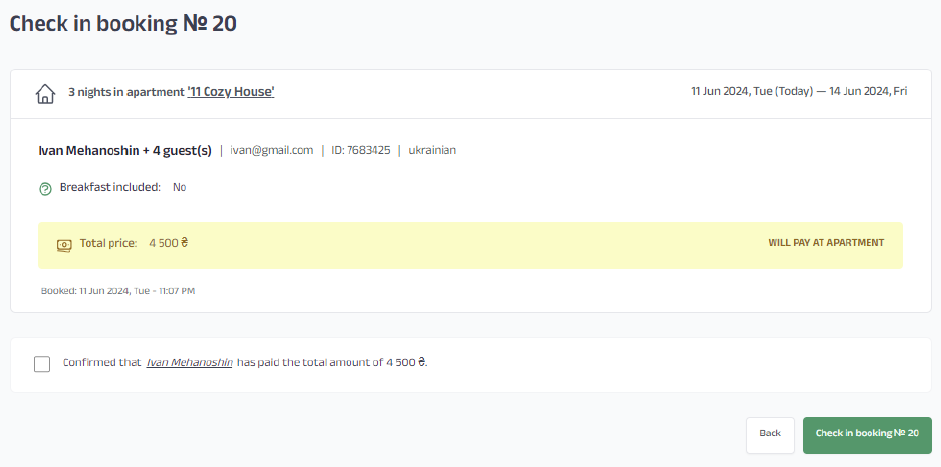
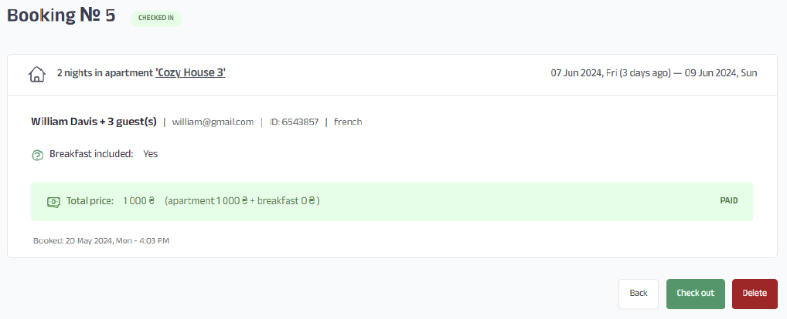
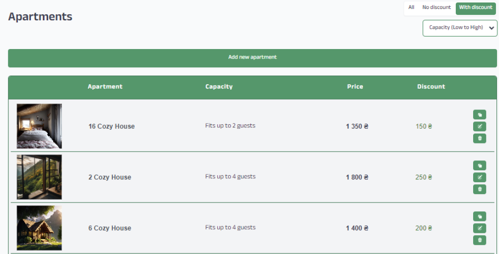
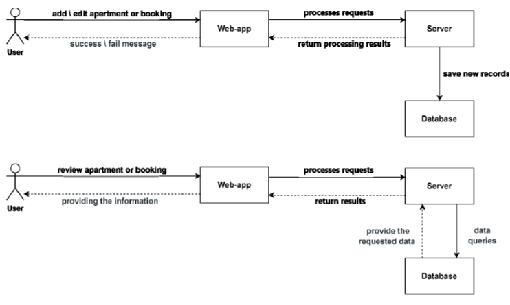
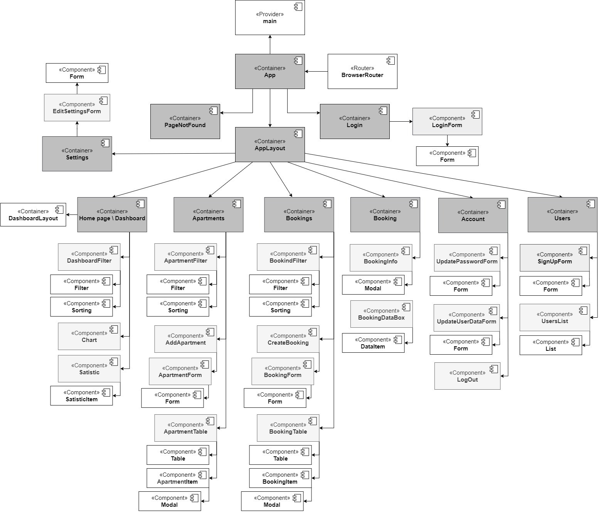
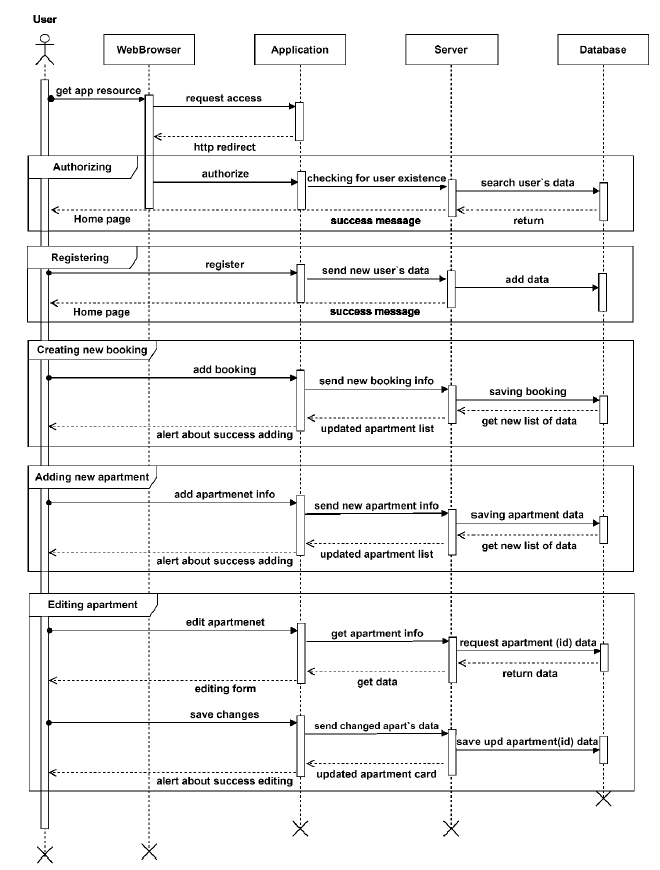
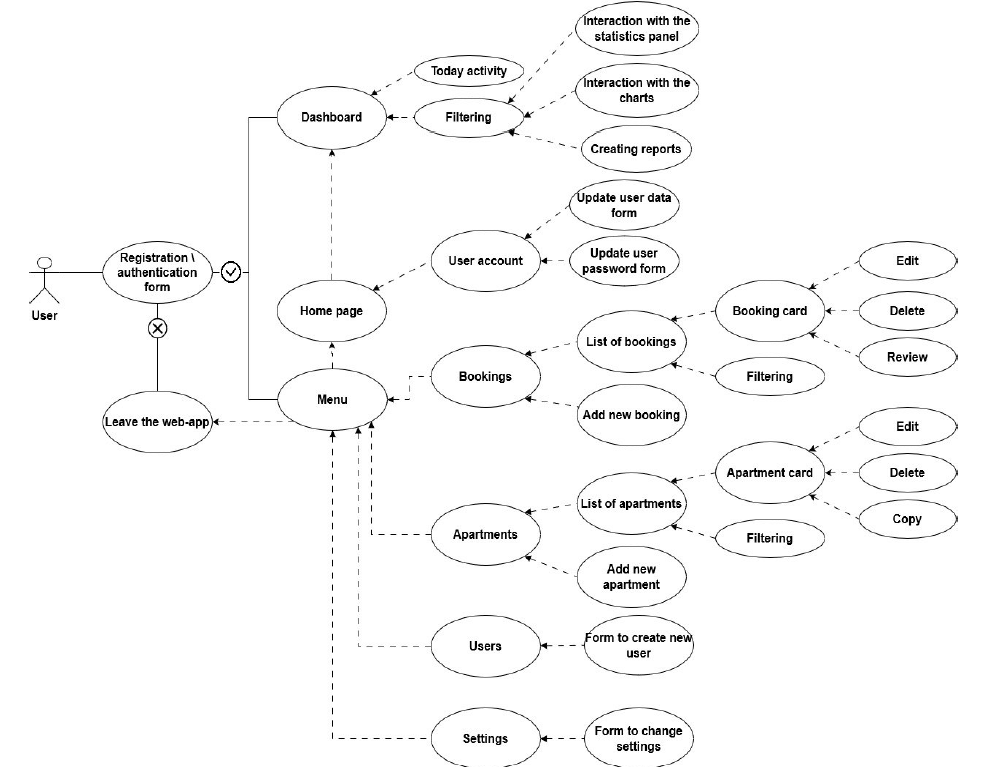

# Mountain Lodge

The work is devoted to the development of an automated information system that allows you to keep records of customer and apartment data, and process room reservations. The information system has the form of a web application. The following development tools were used: JS, React technologies, Recharts, Context API, Styled Components, Superbase, npm.

The main goal of this work is to create an information system for hotel management. The system will be aimed at landlords who provide houses for use in Transcarpathia. This aspiration is aimed at supporting Ukrainian entrepreneurs and the country's economy, as well as helping small businesses.

## Deployed on Netlify: https://mountain-lodge.netlify.app/login

### Dashboard
.png)

### Check in page

### Booking page

### Apartment page

## Diagrams

### Cooperative diagram of load on objects

### React component diagram UML

### Sequence diagram for hotel management

### Use case diagram

